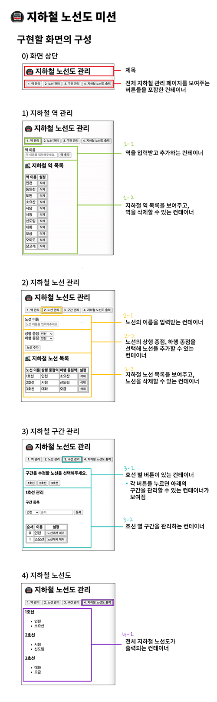

# 🚇 지하철 노선도 미션

> 지하철 노선도 미션은 우아한 테크코스 프리코스 3주차 미션입니다.

지하철 노선도 미션에서는 유저가 지하철 역과 역을 포함하고있는 노선과 노선의 구간을 관리하고, 그에 따라 만들어진 전체 지하철 노선도를 출력해볼 수 있는 화면을 만듭니다.

## ✔️ 주어진 요구사항

- [기능요구사항](#기능-요구사항)
- [프로그래밍 요구사항](#프로그래밍-요구사항)
- [추가된 요구사항](#추가된-요구사항)
- [미션 저장소 및 진행 요구사항](#미션-저장소-및-진행-요구사항)

## ✔️ 주어진 참고사항

- [프로그램 실행 결과](#프로그램-실행-결과)

## ✔️ 피드백 정리

- [2주차 피드백 정리](#2주차-피드백-정리)

## ✔️ 화면의 구성



## ✔️ 구현할 기능 목록

### 0. 전체 화면

- 전체 지하철 관리

### 1.지하철 역 관리 관련 기능

- 유저로부터 지하철 역 이름을 입력받아 등록하는 기능

  - 🚦**예외 상황**
    - 유저가 지하철 역 이름을 <ins>1글자</ins>만 입력하거나 <ins>입력하지 않았을 때</ins> ex) `"잠"`, `""`
    - 유저가 <ins>완성되지 않은 역 이름을</ins> 입력했을 때 ex) `"잠ㅁ실"`, `"서ㅓㄱ촌"`
    - 유저가 <ins>중복된 지하철 역 이름을</ins> 입력했을 때
    - 유저가 <ins>공백으로 시작하거나 끝나는 역 이름을</ins> 입력했을 때
    - 유저가 <ins>연속적인 공백이 들어간 역 이름을</ins> 입력했을 때
    - 유저가 <ins>특수문자 가 포함된 역 이름을</ins> 입력했을 때 ex) `"잠실역;;"`, `"*석촌*"`

- 저장된 지하철 역 목록을 보여주는 기능
- 저장된 지하철 역에서 역을 삭제할 수 있는 기능
  - 🚦**예외 상황**
    - 노선에 등록된 역은 삭제할 수 없음

### 2.지하철 노선 관리 관련 기능

- 유저로부터 노선 이름을 입력받아 등록하는 기능

  - 🚦**예외 상황**
    - 유저가 노선 이름을 <ins>입력하지 않았을 때</ins> ex) `""`
    - 유저가 <ins>완성되지 않은 노선 이름</ins>을 입력했을 때 ex) `"경ㅇ의중앙선"`, `"4호선ㄴ"`
    - 유저가 <ins>중복된 노선 이름을</ins> 입력했을 때
    - 유저가 <ins>공백으로 시작하거나 끝나는 노선 이름을</ins> 입력했을 때
    - 유저가 <ins>연속적인 공백이 들어간 노선 이름을</ins> 입력했을 때
    - 유저가 <ins>특수문자가 포함된 노선 이름을</ins> 입력했을 때

- 저장된 노선 목록을 보여주는 기능
- 저장된 노선 목록에서 노선을 삭제할 수 있는 기능

### 3.지하철 구간 관리 관련 기능

- 각 노선 별로 만들어진 버튼을 누르면 해당 노선 관리 컨테이너를 보여주는 기능
- 역을 선택하고 유저의 입력을 받아 노선의 순서를 정할 수 있는 기능

  - 하나의 역은 여러 개의 노선에 추가될 수 있음
  - 역과 역 사이에 새로운 역이 추가될 수 있음
  - 🚦**예외 상황**
    - 유저가 노선의 순서를 <ins>0 또는 음수</ins>로 입력했을 때
    - 유저가 노선의 순서를 <ins>소수</ins>로 입력했을 때 ex) `1.2`

- 역을 노선에서 삭제할 수 있는 기능
  - 종점을 제거할 경우, 그 다음 역이 종점이 됨
  - 🚦**예외 상황**
    - <ins>노선에 포함된 역이 2개 이하</ins>일 때 역을 제거할 수 없음

### 4.지하철 노선도 출력 관련 기능

- 노선 별 저장된 역들을 순서대로 모두 출력하는 기능

---

## 기능 요구사항

### 지하철 역 관련 기능

- 지하철 역을 등록하고 삭제할 수 있다. (단, 노선에 등록된 역은 삭제할 수 없다)
- 중복된 지하철 역 이름이 등록될 수 없다.
- 지하철 역은 2글자 이상이어야 한다.
- 지하철 역의 목록을 조회할 수 있다.

### 지하철 노선 관련 기능

- 지하철 노선을 등록하고 삭제할 수 있다.
- 중복된 지하철 노선 이름이 등록될 수 없다.
- 노선 등록 시 상행 종점역과 하행 종점역을 입력받는다.
- 지하철 노선의 목록을 조회할 수 있다.

### 지하철 구간 추가 기능

- 지하철 노선에 구간을 추가하는 기능은 노선에 역을 추가하는 기능이라고도 할 수 있다.
  - 역과 역사이를 구간이라 하고 이 구간들의 모음이 노선이다.
- 하나의 역은 여러개의 노선에 추가될 수 있다.
- 역과 역 사이에 새로운 역이 추가 될 수 있다.
- 노선에서 갈래길은 생길 수 없다.


### 지하철 구간 삭제 기능

- 노선에 등록된 역을 제거할 수 있다.
- 종점을 제거할 경우 다음 역이 종점이 된다.
- 노선에 포함된 역이 두개 이하일 때는 역을 제거할 수 없다.


### 지하철 노선에 등록된 역 조회 기능

- 노선의 상행 종점부터 하행 종점까지 연결된 순서대로 역 목록을 조회할 수 있다.

<br />

## 프로그램 실행 결과

### 역관리


### 노선관리


### 구간관리


### 노선도 출력


## 프로그래밍 요구사항

### 메뉴 버튼

- 역 관리 button 태그는 `#station-manager-button` id값을 가진다.
- 노선 관리 button 태그는 `#line-manager-button` id값을 가진다.
- 구간 관리 button 태그는 `#section-manager-button` id값을 가진다.
- 지하철 노선도 출력 관리 button 태그는 `#map-print-manager-button` id값을 가진다.

### 지하철 역 관련 기능

- 지하철 역을 입력하는 input 태그는 `#station-name-input` id값을 가진다.
- 지하철 역을 추가하는 button 태그는 `#station-add-button` id값을 가진다.
- 지하철 역을 삭제하는 button 태그는 `.station-delete-button` class값을 가진다.

### 지하철 노선 관련 기능

- 지하철 노선의 이름을 입력하는 input 태그는 `#line-name-input` id값을 가진다.
- 지하철 노선의 상행 종점을 선택하는 select 태그는 `#line-start-station-selector` id값을 가진다.
- 지하철 노선의 하행 종점을 선택하는 select 태그는 `#line-end-station-selector` id값을 가진다.
- 지하철 노선을 추가하는 button 태그는 `#line-add-button` id값을 가진다.
- 지하철 노선을 삭제하는 button 태그는 `.line-delete-button` class값을 가진다.

### 지하철 구간 추가 기능

- 지하철 노선을 선택하는 button 태그는 `.section-line-menu-button` class값을 가진다.
- 지하철 구간을 설정할 역 select 태그는 `#section-station-selector` id값을 가진다.
- 지하철 구간의 순서를 입력하는 input 태그는 `#section-order-input` id값을 가진다.
- 지하철 구간을 등록하는 button 태그는 `#section-add-button` id값을 가진다.
- 지하철 구간을 제거하는 button 태그는 `.section-delete-button` class값을 가진다.

### 지하철 노선도 출력 기능

- 지하철 노선도 출력 버튼을 누르면 `<div class="map"></div>` 태그를 만들고 해당 태그 내부에 노선도를 출력한다.

### 기존 요구사항

- 사용자가 잘못된 입력 값을 작성한 경우 `alert`을 이용해 메시지를 보여주고, 재입력할 수 있게 한다.
- 외부 라이브러리(jQuery, Lodash 등)를 사용하지 않고, 순수 Vanilla JS로만 구현한다.
- **자바스크립트 코드 컨벤션을 지키면서 프로그래밍** 한다
  - [https://google.github.io/styleguide/jsguide.html](https://google.github.io/styleguide/jsguide.html)
  - [https://ui.toast.com/fe-guide/ko_CODING-CONVENSION/](https://ui.toast.com/fe-guide/ko_CODING-CONVENTION)
- **indent(인덴트, 들여쓰기) depth를 3이 넘지 않도록 구현한다. 2까지만 허용**한다.
  - 예를 들어 while문 안에 if문이 있으면 들여쓰기는 2이다.
  - 힌트: indent(인덴트, 들여쓰기) depth를 줄이는 좋은 방법은 함수(또는 메소드)를 분리하면 된다.
- **함수(또는 메소드)의 길이가 15라인을 넘어가지 않도록 구현한다.**
  - 함수(또는 메소드)가 한 가지 일만 잘 하도록 구현한다.
- 변수 선언시 `var` 를 사용하지 않는다. `const` 와 `let` 을 사용한다.
  - [const](https://developer.mozilla.org/ko/docs/Web/JavaScript/Reference/Statements/const)
  - [let](https://developer.mozilla.org/ko/docs/Web/JavaScript/Reference/Statements/let)
- `import` 문을 이용해 스크립트를 모듈화하고 불러올 수 있게 만든다.
  - [https://developer.mozilla.org/ko/docs/Web/JavaScript/Reference/Statements/import](https://developer.mozilla.org/ko/docs/Web/JavaScript/Reference/Statements/import)
- `template literal`을 이용해 데이터와 html string을 가독성 좋게 표현한다.
  - [https://developer.mozilla.org/ko/docs/Web/JavaScript/Reference/Template_literals](https://developer.mozilla.org/ko/docs/Web/JavaScript/Reference/Template_literals)

### 추가된 요구사항

- [data](https://developer.mozilla.org/ko/docs/Learn/HTML/Howto/%EB%8D%B0%EC%9D%B4%ED%84%B0_%EC%86%8D%EC%84%B1_%EC%82%AC%EC%9A%A9%ED%95%98%EA%B8%B0)속성을 활용하여 html 태그에 역, 노선, 구간의 유일한 데이터 값들을 관리한다.
- [localStorage](https://developer.mozilla.org/ko/docs/Web/API/Window/localStorage)를 이용하여, 새로고침하더라도 가장 최근에 작업한 정보들을 불러올 수 있도록 한다.

<br/>

## 미션 저장소 및 진행 요구사항

- 미션은 [https://github.com/woowacourse/javascript-subway-map-precours](https://github.com/woowacourse/javascript-subway-map-precourse) 저장소를 fork/clone해 시작한다.
- **기능을 구현하기 전에 javascript-subway-precourse/docs/README.md 파일에 구현할 기능 목록**을 정리해 추가한다.
- **git의 commit 단위는 앞 단계에서 README.md 파일에 정리한 기능 목록 단위로 추가**한다.
- [프리코스 과제 제출](https://github.com/woowacourse/woowacourse-docs/tree/master/precourse) 문서 절차를 따라 미션을 제출한다.

---

## 2주차 피드백 정리

> 🔫: 1주차 피드백에서도 강조된 부분

### 📌기능 목록 구현

- 🔫기능 목록 구현을 재검토한다.

  - 기능 목록을 너무 상세히 작성하지 않는다. (언제든 변경될 수 있기 때문)
  - 구현해야 할 기능 목록을 정리하는 데 집중한다.
  - **예외적인 상황도 기능 목록에 정리한다.**
    - 기능을 구현하며 계속해서 추가해 나간다.
  - 기능 목록 작성 예시(자동차 경주 게임)

    ```text
    - 사용자가 입력한 이름을 쉼표 기준으로 분리해야 한다.
    - 사용자 이름이 5자 이하인지 검증해야 한다.
    - 자동차는 4이상인 경우 전진한다.
    - 자동차는 4미만인 경우 정지한다.
    - 0 ~ 9 사이의 임의의 값을 생성한다.
    - 여러 대의 자동차 중 최대 위치 값을 구한다.
    - 최대 위치 값에 해당하는 자동차 목록을 구한다.
    ```

### 📌Git

- git `commit message`에 `#번호`를 추가하지 않는다.
  - `#번호`는 `다른 이슈` 또는 `Pull Request`를 참조할 때 사용한다.
- git을 통해 관리할 자원에 대해서도 고려한다.
  - `.idea`, `.vscode`, `node_modules` 등과 같은 경우 git으로 관리하지 않아도 된다.
  - git에 파일을 추가할 때에는 git을 통해 관리할 필요가 있는 지 여부를 고려해야 한다.
- Pull Request를 보내기 전, 브랜치를 확인한다.
  - 새로 만든 브랜치에서 작업한 후, PR을 보닌다.

### 📌상수, 이름 및 주석

- 가능하면 하드코딩되는 값들을 `상수`로 활용한다.
- 서비스, 게임 등에서는 로직이 변경되거나 요구사항이 추가될 수 있기 때문에, 해당하는 값들을 하드코딩하다보면 수정 과정 중에 휴먼 에러가 발생할 수 있기 때문이다.
- 하드코딩 되는 값들의 예시(자동차 경주 게임)

  ```text
  - 이동/정지 기준 : 4
  - Random 생성 기준 : 10
  - 여러 에러 메시지들
  ```

- 🔫`이름`을 통해 의도를 드러내라.

  - 변수, 함수 이름을 축약하지 말아라.
  - 의도를 드러낼 수 있다면 이름이 길어져도 괜찮다.

- 🔫주석은 꼭 필요한 경우만 남긴다.
  - 가능하면 변수 이름, 함수(메소드) 이름을 통해 의도를 드러내고, 의도를 드러내기 힘든 경우 주석을 단다.

### 📌Coding

- Boolean을 return하는 경우, 간결히 한다.

  - 좋지 않은 예시

    ```javascript
    const isValidCar = (car) => {
      if (car.hasValidName()) {
        return true;
      }
      return false;
    };
    ```

  - 좋은 예시 (보다 명확하고, 코드가 간결)

    ```javascript
    const isValidCar = () => {
      return car.hasVAlidName();
    };
    ```

- javascript에서 제공하는 api를 적극적으로 활용한다.

  - 메소드를 직접 구현하기 전에, javascript api에서 제공하는 기능인지 검색을 먼저 해본다.
  - 제공하지 않는 기능일 경우, 직접 구현한다.
  - 자동차 경주 게임의 우승자 출력 예시

    ```javascript
    const winners = ["east", "west", "south"];
    winners
      .map((winner) => {
        return winner;
      })
      .join(",");
    // "east,west,south"
    ```

- 불필요한 변수를 줄이기 위해 노력한다.

  - 복잡도와 버그가 발생할 가능성을 높인다.
  - 중복이 있는지 확인해 `멤버변수의 수`를 최소화한다.
  - 자동차 경주 게임 예시

    - 좋지 않은 예시

      ```javascript
      function RacingCarGame() {
        this.cars;
        this.maxDistance;
        this.winners;
      }
      ```

    - 좋은 예시

      ```javascript
      function RacingCarGame() {
        this.cars;

        this.getWinners = () => {...}
        this.getMaxDistance = () => {...}
      }
      ```

- 비지니스 로직과 UI 로직을 분리해라.

  - 비지니스 로직과 UI 로직을 한 함수가 담당하지 않도록 한다.
  - 단일 책임의 원칙을 지켜야 한다.
  - 자동차 경주 게임 예시

    - 좋지 않은 예시

      ```javascript
      function Car() {
        this.position = 0;

        // 자동차 이동 여부를 결정하는 비지니스 로직
        this.move = (randomNumber) => {...} ;

        // UI 로직
        this.render = () => {
          $element.innerHTML = template()
        };
      }
      ```

- 함수(메소드) 라인에 대한 기준

  - 공백 라인도 한 라인에 해당하기 때문에 주석은 가능하면 함수 밖 또는 코드 우측에 추가하는 방식으로 구현한다.

- 발생할 수 있는 예외 케이스에 대해 고민한다.

  - 정상적인 경우를 구현하는 것보다 예외 상황을 모두 고려해 프로그래밍하는 것이 더 어렵다.
  - 예외 상황을 잘 고려해 프로그래밍하는 `습관`을 들여야 한다.
  - 그리고 이러한 예외 상황에 대한 처리를 잘 할 수 있어야 한다.
  - 자동차 경주 게임의 예외상황 예시

    ```text
    - 만약 진행할 게임의 횟수에 음수를 입력한다면?
    - 만약 이름에 빈 값을 넣는다면?
    - 만약 쉼표를 이름으로 넣는다면?
    ```
