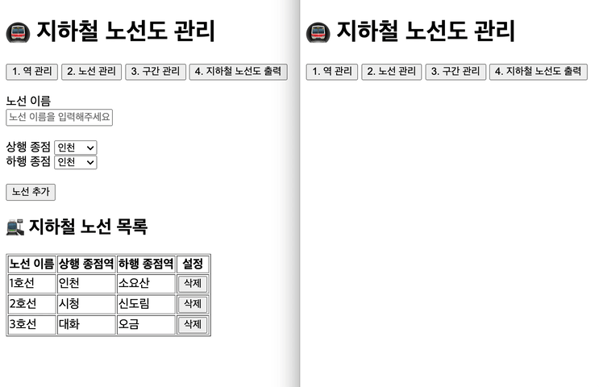
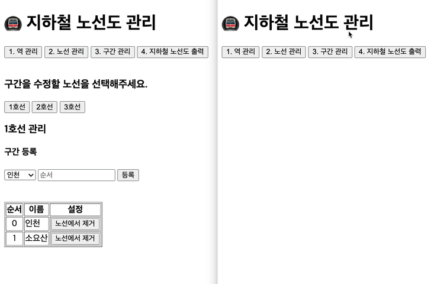
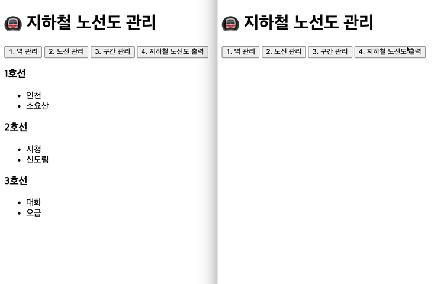

# 🚇 프리코스 3주차 미션 - 지하철 노선도

## 🚀 소개

## 🚀 모듈 목록

## 🚀 기능 목록
- 브라우저 화면 진입시, 제목과 각 기능을 담당하는 버튼 4개가 렌더링된다.
- 데이터의 변화가 생긴 후 새로고침을 해도 값이 저장되도록 한다.
  - 역 추가, 삭제 (o)
  - 노선 관리에서 select option (o)
  - 노선 추가, 삭제
### 1. 역 관리
- 역을 등록한다. (o)
  - 역은 2 글자 이상이다. (o)
  - 역은 중복될 수 없다. (o)
- 역을 삭제한다. (o)
  - 노선에 등록된 역은 삭제할 수 없다. (o)
- 역의 목록을 조회한다. (o)
### 2. 노선 관리
- select option render는 두 가지 이유로 업데이트 된다.
  - 새로고침 (추가, 삭제 o)
  - 역 관리에서 값의 변화가 일어났을 때 (추가, 삭제 o)
- 노선을 등록한다. (o)
  - 노선은 중복될 수 없다. (o)
  - 노선 등록 시 상행, 하행 종점 역을 선택한다. (o)
- 노선을 삭제한다.
- 노선의 목록을 조회한다. (o)
### 3. 구간 관리
- 존재하는 노선을 버튼으로 렌더링 한다.
  - 버튼의 값은 정렬 되어 있어야 한다.
  - 일정 개수가 넘어가면 밑으로 렌더링되도록 레이아웃을 잡아 준다. (6개 예상)
- 구간을 등록한다.
  - 역과 순서를 등록한다.
  - 역과 역사이에 새로운 역을 추가할 수 있다.
  - 역은 중복될 수 없다.
- 구간을 삭제한다.
  - 노선의 역이 두 개 이하라면 역을 제거할 수 없다.
  - 종점을 삭제하면 그 전(다음) 역이 종점이 된다.
- 해당 노선의 목록을 조회한다.
### 4. 지하철 노선도 출력
- 존재하는 모든 노선과 그 역들을 렌더링 한다.
### 5. etc
- && 으로 이항 처리
- appendChild() => append()

## 🧨 예외 처리

### 1. 역 관리
- 역 이름이 올바르지 않다면 경고 메시지와 함께 참고할 수 있는 ~~사이트 링크를 부여한다.~~ (o)
- 삭제 버튼을 눌렀을 때 기존 노선에 존재하는 역이라면 경고 메시지와 함께 현재 역이 포함된 노선을 제시한다.
### 2. 노선 관리
- 노선의 이름은 미리 선언해두어 입력 값과 비교 후 노선을 추가하도록 한다. (o)
- 노선 이름이 올바르지 않다면 경고 메시지와 함께 ~~참고할 수 있는 사이트 링크를 부여한다~~. (o)
- 노선의 종점은 상, 하행 통틀어 중복될 수 없다. (o)
### 3. 구간 관리
- 순서는 상, 하행 종점 순서 사이 값만 입력할 수 있다.

## ✔️ 이슈

## 💻 구현된 프로그램

### 역관리

### 노선관리

### 구간관리

### 노선도 출력
